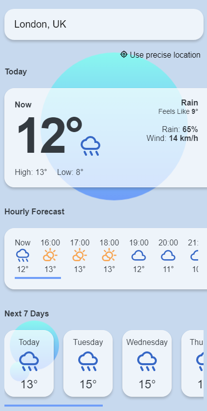
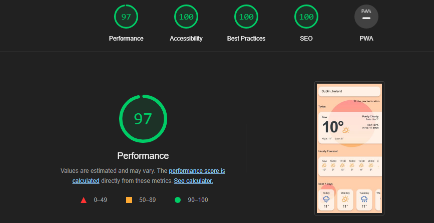

# Weather App

You can view the deployed web application at [IsSunny.co](https://issunny.co/).


## About

A simple weather application built with SvelteKit, [Open-Meteo](https://open-meteo.com/) and Google Maps API.
The key features of this application include:

- Display the current weather
- Forecast the weather for the next 24 hours
- Forecast for the next 7 days
- Get the user's location to show local weather
- Location search to get the weather for any location

## Screenshots

Here is a screenshot of the web application:




## Performance




## Local Development

Follow these steps to serve the app locally:

1. Clone the repository:

```bash
git clone https://github.com/Guilhermecampano/weather-app.git
```

2. Install the dependencies:

```bash
cd weather-app
npm install
```

3. Create a `.env` file in the root of the project with the following content:

```bash
GOOGLE_API_KEY='YOUR_API_KEY'
PRIVATE_SECRET_KEY='JWT_SECRET_KEY'
PRIVATE_MOCK_API='FALSE'
```

4. Serve the app:

```bash
npm run dev
```


## Build

```bash
npm run build
npm run preview
```

